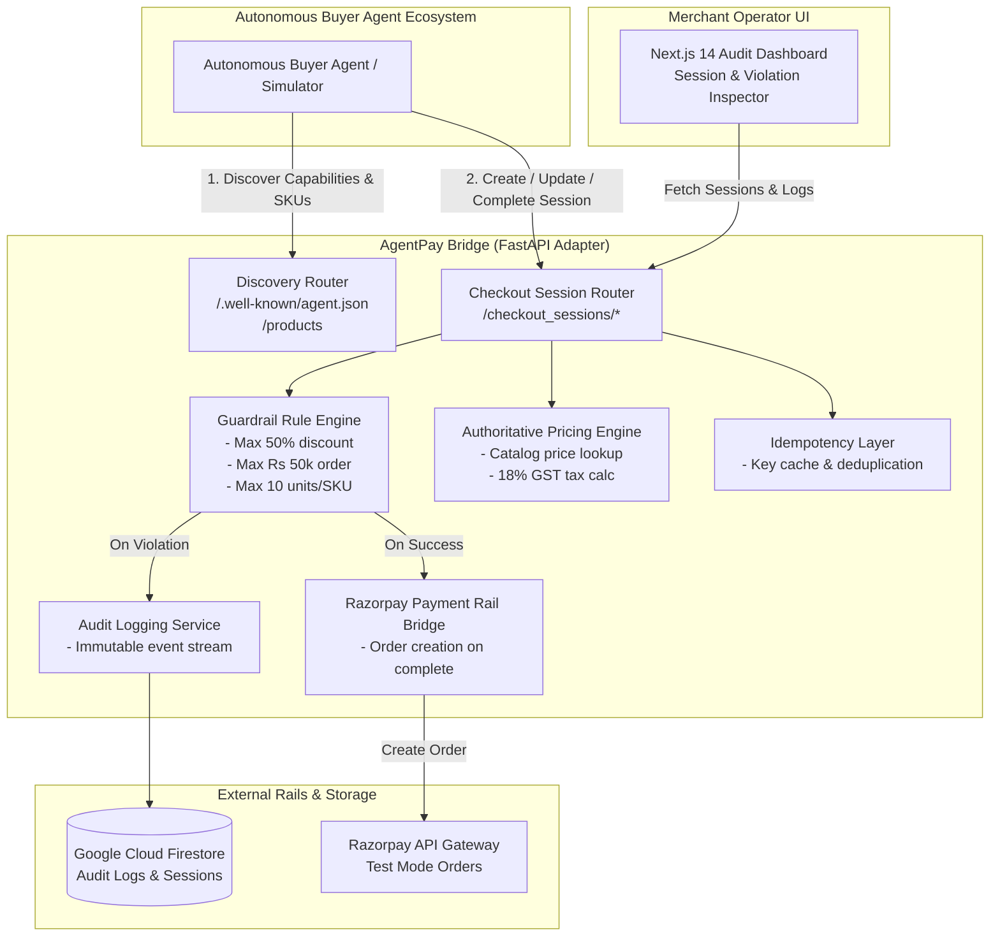

# AgentPay Bridge

> **ACP-compliant checkout adapter for autonomous AI buyer agents.**  
> *Enforces server-authoritative catalog pricing, deterministic guardrails, 30-min inventory soft-holds, and immutable audit trails. Payment rail: Razorpay Orders API.*

[](backend/tests)
[](docs/architecture.md)
[](LICENSE)
[](https://fastapi.tiangolo.com)
[-black.svg)](https://nextjs.org)

---

## 💡 The Problem & The Solution

**The Problem**: As autonomous AI buyer agents take over consumer and B2B purchasing workflows, merchant payment gateways face critical vulnerabilities:
1. **Price & Discount Tampering**: Rogue or hallucinating agents manipulating client-side totals.
2. **Unbounded Financial Exposure**: Over-ordering beyond inventory or financial risk boundaries.
3. **Lack of Auditability**: Opaque API calls without explainable decision trails.

**The Solution**: **AgentPay Bridge** bridges the open **Agentic Commerce Protocol (ACP `v2026-04-17`)** to Razorpay's battle-tested payment rail. It enforces:
- **Server-Authoritative Pricing**: Catalog lookups strictly ignore client-supplied unit prices.
- **Deterministic Guardrails**: Hard limits on maximum discounts (50%), order values (Rs 50,000), and quantities (10 units).
- **Inventory Soft-Holds & 30-Min TTL**: Reserves stock across cart mutations with automated sweeper release.
- **Idempotency Deduplication**: Native `Idempotency-Key` header handling and replay caching.
- **Cryptographic Webhooks**: HMAC-SHA256 signed inbound/outbound event delivery with anti-replay timestamps.
- **Explainable Firestore Audit Trail**: Immutable before/after state transitions and explicit rejection reasons.
- **Executive Operator Dashboard**: Real-time Next.js 14 console with interactive 3D telemetry and session inspector.

---

## 🏗️ Architecture Overview



For complete technical specifications, see [`docs/architecture.md`](docs/architecture.md).

---

## 🚀 Quick Start (Local Setup)

### 1. Prerequisites
- Python 3.10+
- Node.js 18+ & npm

### 2. Backend Setup
```bash
# Clone the repository
git clone https://github.com/TaskDrift/razorpay-acp-adapter.git
cd razorpay-acp-adapter

# Create & activate virtual environment
python -m venv .venv
source .venv/bin/activate  # On Windows: .venv\Scripts\activate

# Install dependencies
pip install -r backend/requirements.txt

# Configure environment variables
cp .env.example .env

# Run FastAPI backend server
python -m uvicorn backend.main:app --host 0.0.0.0 --port 8000 --reload
```
*Backend runs on `http://localhost:8000` (`/health` & `/.well-known/agent.json`)*.

### 3. Frontend Dashboard Setup
```bash
cd frontend
npm install
npm run dev
```
*Dashboard runs on `http://localhost:3000` with live session streams and audit inspector*.

### 4. Run the Autonomous Buyer Agent Simulator
In a separate terminal, trigger the headless buyer agent:
```bash
python buyer_agent_sim.py
```
*The simulator discovers products, creates checkout sessions, applies updates, tests guardrail rejections, and completes real Razorpay test-mode orders.*

---

## 🧪 Running Automated Tests

Run the complete test suite (91 unit, integration, and guardrail tests):
```bash
pytest
```

---

## 📡 Protocol API Reference

| Method | Endpoint | Description |
|---|---|---|
| `GET` | `/.well-known/agent.json` | Machine-readable capability feed for buyer agents |
| `GET` | `/products` | Authoritative 5-SKU merchant product catalog |
| `POST` | `/checkout_sessions` | Create a checkout session (supports `Idempotency-Key`) |
| `GET` | `/checkout_sessions/{id}` | Retrieve current authoritative session state |
| `POST` | `/checkout_sessions/{id}` | Update line items, buyer details, or discounts |
| `POST` | `/checkout_sessions/{id}/complete` | Finalize session & bridge to Razorpay Orders API |
| `POST` | `/checkout_sessions/{id}/cancel` | Cancel an active checkout session |
| `GET` | `/checkout_sessions` | List all sessions for dashboard |
| `GET` | `/checkout_sessions/{id}/audit` | Chronological immutable audit history for session |
| `GET` | `/audit_entries` | Global audit stream across all sessions |
| `POST` | `/webhooks/razorpay` | Inbound HMAC-verified payment capture & refund webhooks |
| `POST` | `/internal/sweep_expired` | Background sweeper releasing expired 30-min inventory holds |
| `GET` | `/health` | Liveness / health probe |

---

## 🛡️ Guardrail Rules Matrix

| Rule | Constraint | Response on Violation |
|---|---|---|
| **Max Discount** | Capped at 50% of subtotal | `HTTP 400` + Session status `rejected` + Logged Reason |
| **Max Order Value** | Capped at Rs 50,000 INR | `HTTP 400` + Session status `rejected` + Logged Reason |
| **Max Quantity** | Capped at 10 units per SKU | `HTTP 400` + Session status `rejected` + Logged Reason |
| **Idempotency** | Replayed `Idempotency-Key` | Replays existing session without duplicating charges |

---

## 📦 Deployment

See [`docs/DEPLOYMENT.md`](docs/DEPLOYMENT.md) for step-by-step instructions:
- **Backend**: Containerized via [`Dockerfile`](Dockerfile) on Google Cloud Run.
- **Frontend**: Next.js App Router on Vercel.

---

## 📄 License

This project is licensed under the MIT License — see the [`LICENSE`](LICENSE) file for details.
