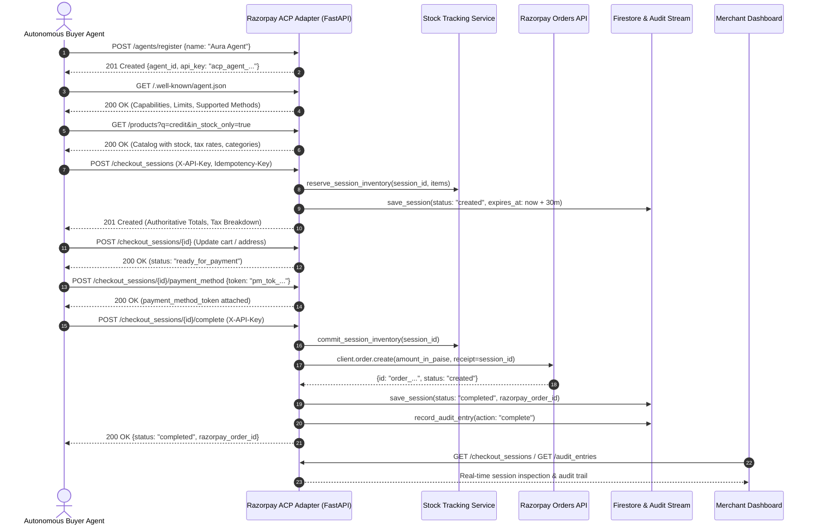

# PROJECT_MAP — Razorpay ACP Checkout Adapter
> Comprehensive Technical Map, Architecture Spec & Deep Defense Reference for Track 01 (AI Growth & Agentic Commerce)

---

## 1. Overview

- **Purpose**: Spec-compliant Agentic Commerce Protocol (ACP `v2026-04-17`) checkout adapter backed by Razorpay. It bridges autonomous AI buyer agent intents into bounded, gated, and auditable financial transactions with server-authoritative catalog pricing, deterministic guardrail evaluation, inventory soft-holds, rate limiting, behavioral anomaly scoring, and cryptographic webhook delivery.
- **Users / Roles**:
  - **Autonomous Buyer Agent**: Machine agent authenticated via `X-API-Key` that discovers capabilities, queries products, creates/mutates sessions, attaches payment tokens, and initiates purchases.
  - **Merchant Operator**: Human operator using the Next.js 14 dashboard to monitor real-time sessions, inspect immutable audit trails, and review anomaly flags.
  - **Payment Rail / Inbound Webhook**: Razorpay gateway posting signed `order.paid` or `payment.captured` callbacks to reconcile payment states.
  - **Internal Maintenance / Sweeper**: Automated background worker or Cloud Scheduler executing session TTL sweeps and releasing soft-held inventory.
- **Live URLs / Subdomains**:
  - Local API: `http://localhost:8000`
  - Local Dashboard: `http://localhost:3000`
  - Production Deployments: [NEEDS INPUT: Production Cloud Run URL and Vercel dashboard domain; referenced as `https://razorpay-acp-adapter-<hash>-el.a.run.app` in `docs/DEPLOYMENT.md`]

---

## 2. Tech Stack

- **Backend Framework**: FastAPI (`>=0.110.0`), Uvicorn (`>=0.28.0`), Pydantic v2 (`>=2.6.0`), Pydantic-Settings (`>=2.2.0`).
- **Frontend Dashboard**: Next.js 14 (`14.2.5` App Router), React 18 (`18.3.1`), TypeScript (`5.5.2`), Tailwind CSS (`3.4.4`), Lucide React (`0.359.0`).
- **Database & Storage**: Google Cloud Firestore (Native Mode via `google-cloud-firestore>=2.14.0`) with thread-safe in-memory fallback for offline/test isolation.
- **Agent Authentication**: Cryptographic per-agent API keys (`acp_agent_<32-hex-chars>`, 128-bit entropy), stored as SHA-256 hashes, enforced via FastAPI dependency `get_authenticated_agent_id`.
- **Payment Gateway**: Razorpay Orders and Refunds API (`razorpay>=1.4.1`) with test mode fallback, paise conversion, and exponential backoff retry.
- **Protocol Schema Validation**: `jsonschema>=4.20.0` validating ACP specification payloads.
- **Webhooks & Cryptography**:
  - Outbound: HMAC-SHA256 signatures with timestamp anti-replay headers, exponential retry backoff, and dead-letter queue persistence.
  - Inbound: HMAC-SHA256 verification using `hmac.compare_digest` against raw request bytes.
- **Email**: None (out of scope for ACP protocol adapter).
- **Hosting / Infrastructure**: Docker containerized (`python:3.11-slim`) for Google Cloud Run (`asia-south1`); Vercel for Next.js dashboard.

---

## 3. Data Model + DB Logic

### Tables / Collections / Pydantic Models

#### 1. `checkout_sessions` (`CheckoutSession` — `backend/models.py`)
- **Purpose**: Tracks the full lifecycle of an autonomous buyer agent checkout session.
- **Fields**:
  - `id` (`str`, PK): Unique identifier formatted as `cs_<16-hex-chars>`.
  - `status` (`SessionStatus`): Current state (`created`, `updated`, `ready_for_payment`, `completed`, `refunded`, `rejected`, `cancelled`).
  - `line_items` (`List[LineItem]`): Items in cart. Each item contains `product_id: str`, `quantity: int (gt=0)`, `unit_price: float (ge=0.0)`, and `tax_rate: float (ge=0.0, le=1.0)`.
  - `buyer` (`Optional[Buyer]`): Contact metadata (`name: str`, `email: str`, `phone: Optional[str]`).
  - `fulfillment_address` (`Optional[Address]`): Physical delivery location (`line1: str`, `line2: Optional[str]`, `city: str`, `state: str`, `postal_code: str`, `country: str`).
  - `totals` (`Totals`): Financial summary (`subtotal: float`, `discount: float`, `tax: float`, `total: float`, `currency: str (ISO 3-char)`, `tax_breakdown: List[TaxBreakdownItem]`).
  - `payment_provider` (`PaymentProvider`): Downstream payment rail details (`provider: "razorpay"`, `razorpay_order_id: Optional[str]`, `refund_id: Optional[str]`).
  - `payment_method_token` (`Optional[str]`): Delegated ACP payment token (`pm_tok_<hex>`).
  - `is_anomalous` (`bool`): Flagged `True` when rolling anomaly score $\ge 70$.
  - `anomaly_score` (`Optional[int]`): Cumulative risk score from 0 to 100.
  - `expires_at` (`Optional[datetime]`): UTC expiry timestamp (`created_at + 30 minutes`).
  - `created_at` (`datetime`): UTC creation timestamp.
  - `updated_at` (`datetime`): UTC last-modified timestamp.

#### 2. `audit_entries` (`AuditEntry` — `backend/models.py`)
- **Purpose**: Immutable append-only audit stream recording all state transitions, guardrail rejections, inventory events, and actor identity.
- **Fields**:
  - `id` (`str`, PK): Unique identifier formatted as `audit_<16-hex-chars>`.
  - `session_id` (`str`, FK): Correlated checkout session ID.
  - `action` (`AuditAction`): Lifecycle action (`create`, `update`, `complete`, `refund`, `reject`, `cancel`, `out_of_stock`, `attach_payment_method`, `flagged_anomalous`).
  - `actor` (`str`): Authenticated `agent_id`, `system_sweep`, `razorpay_webhook`, etc.
  - `reason` (`Optional[str]`): Explainable explanation. Strictly required by Pydantic validator if action is `reject`, `out_of_stock`, or `flagged_anomalous`.
  - `before_total` (`Optional[float]`): Session total prior to action.
  - `after_total` (`Optional[float]`): Session total following action.
  - `timestamp` (`datetime`): UTC execution timestamp.

#### 3. `agents` & `agent_key_hashes` (`backend/services/auth.py`)
- **Purpose**: Manages autonomous agent identities and cryptographic credentials.
- **Fields**:
  - `agent_id` (`str`, PK): Internal identity formatted as `agent_<16-hex-chars>`.
  - `name` (`str`): Human/agent descriptive name.
  - `key_hash` (`str`, PK in `agent_key_hashes`): SHA-256 cryptographic digest of the raw API key (`acp_agent_<32-hex-chars>`).
  - `created_at` (`str` ISO UTC): Registration timestamp.

#### 4. `dead_letter_events` (`DeadLetterEvent` — `backend/models.py`)
- **Purpose**: Persistent diagnostic log for outbound webhooks that failed delivery across all retry attempts.
- **Fields**:
  - `id` (`str`, PK): Formatted as `dle_<16-hex-chars>`.
  - `event_type` (`str`): ACP event type (e.g. `checkout_session.completed`).
  - `session_id` (`Optional[str]`): Associated session ID.
  - `target_url` (`str`): Failed destination endpoint.
  - `last_error` (`str`): Final HTTP error code or network exception string.
  - `attempts` (`int`): Maximum attempt count (default: 3).
  - `timestamp` (`datetime`): UTC failure timestamp.

#### 5. `products` (`Product` — `backend/models.py`)
- **Purpose**: Server-authoritative catalog registry with live inventory and tax slabs.
- **Fields**:
  - `id` (`str`, PK): Product SKU (e.g. `prod_bolt_001`).
  - `name` (`str`): Display name.
  - `price` (`float`): Authoritative unit price in INR.
  - `currency` (`str`): ISO 3-letter currency code (`INR`).
  - `description` (`str`): SKU description.
  - `stock` (`int`): Current available unreserved inventory count.
  - `tax_rate` (`float`): Applicable GST tax slab decimal (`0.12`, `0.18`, or `0.28`).
  - `category` (`str`): Product category for catalog search and filtering.

### Database Access Scoping & Permissions
- **FastAPI Layer**: All mutation endpoints (`POST /checkout_sessions`, `POST /checkout_sessions/{id}`, `POST /checkout_sessions/{id}/complete`, `POST /checkout_sessions/{id}/cancel`, `POST /checkout_sessions/{id}/payment_method`, `POST /checkout_sessions/{id}/refund`) require a valid `X-API-Key` header matching a registered agent hash.
- **Database Layer**: Firestore operations run under Google Cloud Application Default Credentials (ADC) / Cloud Run service account IAM. In local environments, in-memory thread-safe dictionaries with `threading.Lock()` provide equivalent isolation.

### DB Functions / Triggers
- **Atomic Inventory Decrement**: `backend/services/inventory.py:decrement_inventory_atomic` wraps Firestore operations in a `@firestore.transactional` read-and-decrement block, preventing overselling under concurrent load. Falls back to thread-safe locks in-memory.

### Computed-on-Read Fields
- **`totals`**: Never stored as client-provided input; computed fresh from server catalog prices and tax rates on every create and update.
- **FSM State Evaluation**: `ready_for_payment` is computed during `POST /checkout_sessions/{id}`: if `buyer`, `buyer.email`, `fulfillment_address`, `address.country`, and `line_items` are present, and the session is not in a terminal state (`completed`, `refunded`, `rejected`, `cancelled`), it advances to `ready_for_payment`.
- **Expiry Check**: `datetime.now(timezone.utc) > session.expires_at` evaluated dynamically upon mutation attempts and during maintenance sweep.

### Unique Constraints & Business Indexing Rules
- **Idempotency Deduplication**: In-memory and Firestore `idempotency_keys` document ID stores a hash of the client-supplied `Idempotency-Key` mapped to `session_id`. Repeated requests with the same key immediately return the original session without duplicating side-effects.
- **API Key Hash Uniqueness**: Document ID in `agent_key_hashes` is the SHA-256 hash. One key can map to exactly one agent ID.
- **Zero Schema Drift**: Schemaless Firestore documents are strictly validated through Pydantic v2 schemas and ACP JSON schemas (`jsonschema`).

---

## 4. Core Business Logic

All core business algorithms are implemented with strict mathematical formulas and zero external LLM dependencies:

| Rule / Algorithm | Implementation Location | Exact Formula / Condition |
| :--- | :--- | :--- |
| **Authoritative Pricing & Subtotal** | [`backend/services/pricing.py:compute_authoritative_totals`](file:///d:/TaskDrift/razorpay-acp-adapter/backend/services/pricing.py#L19-L69) | Unit prices from request payload are ignored. Looked up in catalog: $\text{item\_subtotal}_i = \text{round}(\text{price}_i \times \text{qty}_i, 2)$. Cart subtotal: $\text{subtotal} = \text{round}(\sum \text{item\_subtotal}_i, 2)$. |
| **Proportional Pre-Tax Discount** | [`backend/services/pricing.py:compute_authoritative_totals`](file:///d:/TaskDrift/razorpay-acp-adapter/backend/services/pricing.py#L70-L85) | Total discount: $D = \text{round}(\min(\text{subtotal}, \max(0, \text{discount})), 2)$. For $i = 0 \dots n-2$: $\text{disc}_i = \text{round}(D \times (\text{item\_subtotal}_i / \text{subtotal}), 2)$. For item $n-1$: $\text{disc}_{n-1} = \text{round}(D - \sum_{j=0}^{n-2} \text{disc}_j, 2)$. |
| **Line-Item Tax & Tax Breakdown** | [`backend/services/pricing.py:compute_authoritative_totals`](file:///d:/TaskDrift/razorpay-acp-adapter/backend/services/pricing.py#L86-L125) | Taxable amount: $T_i = \max(0, \text{round}(\text{item\_subtotal}_i - \text{disc}_i, 2))$. Item tax: $\text{tax}_i = \text{round}(T_i \times \text{tax\_rate}_i, 2)$. Total tax: $\sum \text{tax}_i$. Final total: $\text{round}((\text{subtotal} - D) + \text{total\_tax}, 2)$. Tax items grouped by rate into `tax_breakdown`. |
| **Guardrail: Max Quantity** | [`backend/services/guardrails.py:validate_guardrails`](file:///d:/TaskDrift/razorpay-acp-adapter/backend/services/guardrails.py#L28-L34) | For each line item: $\text{item.quantity} \le 10$. Breaches reject with HTTP 400. |
| **Guardrail: Max Discount Ceiling** | [`backend/services/guardrails.py:validate_guardrails`](file:///d:/TaskDrift/razorpay-acp-adapter/backend/services/guardrails.py#L36-L43) | If $\text{subtotal} > 0$ and $\text{discount} > 0$: $(\text{discount} / \text{subtotal}) \times 100 \le 50.0\%$. Breaches reject with HTTP 400. |
| **Guardrail: Max Order Value** | [`backend/services/guardrails.py:validate_guardrails`](file:///d:/TaskDrift/razorpay-acp-adapter/backend/services/guardrails.py#L45-L50) | Order total: $\text{totals.total} \le 50,000.00\text{ INR}$. Breaches reject with HTTP 400. |
| **Anomaly Scoring Engine** | [`backend/services/anomaly.py:evaluate_anomaly_score`](file:///d:/TaskDrift/razorpay-acp-adapter/backend/services/anomaly.py#L64-L132) | Evaluates sliding windows: 60s session velocity ($\ge 8 \to +95, \ge 6 \to +75, \ge 4 \to +40, \ge 2 \to +10$); 120s guardrail violations ($\ge 3 \to +55, \ge 1 \to +30$); 60s spend velocity ($\ge 80\text{k} \to +35$, single $\ge 40\text{k} \to +20$). Score capped at 100. If $\text{score} \ge 70 \implies \text{is\_anomalous}=\text{True}$. If $\text{score} \ge 90 \implies \text{hard HTTP 400 block}$. |
| **Soft-Hold Inventory Reservation** | [`backend/services/inventory.py:reserve_session_inventory`](file:///d:/TaskDrift/razorpay-acp-adapter/backend/services/inventory.py#L39-L61) | On creation: checks if $\text{qty}_i \le \text{available}_i$. Decrements available stock and records allocation under `_reserved_sessions[session_id]`. Released on cancel/expiry, committed on completion. |
| **Paise Conversion** | [`backend/services/razorpay_service.py:convert_to_paise`](file:///d:/TaskDrift/razorpay-acp-adapter/backend/services/razorpay_service.py#L14-L19) | $\text{paise} = \text{int}(\text{round}(\text{float}(\text{amount}) \times 100))$. Prevents floating-point sub-cent drift. |
| **Inbound Webhook Verification** | [`backend/routers/webhooks.py:verify_razorpay_signature`](file:///d:/TaskDrift/razorpay-acp-adapter/backend/routers/webhooks.py#L23-L36) | Computes $\text{HMAC-SHA256}(\text{secret}, \text{raw\_body})$. Evaluates match via constant-time comparison `hmac.compare_digest(clean_sig, expected)`. |
| **Sliding-Window Rate Limiting** | [`backend/services/rate_limiter.py:is_rate_limited`](file:///d:/TaskDrift/razorpay-acp-adapter/backend/services/rate_limiter.py#L18-L49) | Cleans timestamps older than 60 seconds. If $\text{len}(\text{timestamps}) \ge 120$, returns HTTP 429 with `Retry-After: max(1, int(oldest + 60 - now))`. |

---

## 5. Core Flows

### Flow Sequences

1. **Agent Registration**: Agent calls `POST /agents/register`. Adapter returns `agent_id` and raw secret `acp_agent_<32hex>`, storing SHA-256 hash.
2. **Catalog Discovery & Search**: Agent calls `GET /.well-known/agent.json` and `GET /products?q=...&category=...&min_price=...&max_price=...&in_stock_only=...`. Fully wired.
3. **Session Initialization**: Agent calls `POST /checkout_sessions` with `X-API-Key`. Adapter calculates authoritative totals, validates guardrails, reserves inventory, checks anomaly score, sets `expires_at = now + 30m`, writes audit log, and returns HTTP 201. Fully wired.
4. **Cart Negotiation & State Advancement**: Agent calls `POST /checkout_sessions/{id}`. Checks stock availability, recalculates taxes and discounts, updates FSM to `updated` or `ready_for_payment`. Fully wired.
5. **Delegated Payment Tokenization**: Agent calls `POST /checkout_sessions/{id}/payment_method` with `token: "pm_tok_<hex>"`. Validates format and attaches token. Fully wired.
6. **Checkout Finalization & Payment Rail Bridge**: Agent calls `POST /checkout_sessions/{id}/complete`. Adapter verifies session is active and unexpired, commits inventory reservation, converts amount to paise, calls Razorpay Orders API, transitions to `completed`, records immutable audit log, and dispatches signed webhook. Fully wired.
7. **Session Cancellation**: Agent calls `POST /checkout_sessions/{id}/cancel`. Releases soft-held inventory, locks state to `cancelled`, audits cancellation. Fully wired.
8. **Session Expiry Sweep**: Background sweeper calls `POST /internal/sweep_expired`. Scans open sessions where `utc_now > expires_at`, marks them `cancelled` (`reason: "expired"`), releases soft-held inventory, records audit log, and dispatches webhook. Fully wired.
9. **Inbound Webhook Reconciliation**: Razorpay gateway posts to `POST /webhooks/razorpay` with `X-Razorpay-Signature`. Verifies HMAC-SHA256, matches order ID, defensively validates currency and amount, commits stock, marks session `completed`, and audits event. Fully wired.
10. **Post-Payment Refund Bridge**: Agent/operator calls `POST /checkout_sessions/{id}/refund`. Verifies `completed` state, calls Razorpay Refund API, sets `refunded`, attaches `refund_id`, and records audit entry. Fully wired.

---

## 6. Feature Inventory

| Feature | Status | File Location |
| :--- | :--- | :--- |
| Agent Discovery Protocol Manifest (`/.well-known/agent.json`) | Done | [`backend/routers/discovery.py`](file:///d:/TaskDrift/razorpay-acp-adapter/backend/routers/discovery.py) |
| Authoritative Product Catalog (`GET /products`) | Done | [`backend/routers/discovery.py`](file:///d:/TaskDrift/razorpay-acp-adapter/backend/routers/discovery.py) |
| Catalog Search & Filtering (`q`, `category`, `price`, `stock`) | Done | [`backend/routers/discovery.py`](file:///d:/TaskDrift/razorpay-acp-adapter/backend/routers/discovery.py) |
| Agent API Key Registration (`POST /agents/register`) | Done | [`backend/routers/auth.py`](file:///d:/TaskDrift/razorpay-acp-adapter/backend/routers/auth.py) |
| Agent Header Authentication (`X-API-Key`) | Done | [`backend/services/auth.py`](file:///d:/TaskDrift/razorpay-acp-adapter/backend/services/auth.py) |
| Checkout Session Creation (`POST /checkout_sessions`) | Done | [`backend/routers/checkout.py`](file:///d:/TaskDrift/razorpay-acp-adapter/backend/routers/checkout.py) |
| Checkout Session Retrieval (`GET /checkout_sessions/{id}`) | Done | [`backend/routers/checkout.py`](file:///d:/TaskDrift/razorpay-acp-adapter/backend/routers/checkout.py) |
| Checkout Session Cart Update (`POST /checkout_sessions/{id}`) | Done | [`backend/routers/checkout.py`](file:///d:/TaskDrift/razorpay-acp-adapter/backend/routers/checkout.py) |
| Payment Method Tokenization (`POST /.../payment_method`) | Done | [`backend/routers/checkout.py`](file:///d:/TaskDrift/razorpay-acp-adapter/backend/routers/checkout.py) |
| Checkout Completion & Order Rail Bridge (`POST /.../complete`) | Done | [`backend/routers/checkout.py`](file:///d:/TaskDrift/razorpay-acp-adapter/backend/routers/checkout.py) |
| Session Cancellation & Lock (`POST /.../cancel`) | Done | [`backend/routers/checkout.py`](file:///d:/TaskDrift/razorpay-acp-adapter/backend/routers/checkout.py) |
| Post-Payment Refund Bridge (`POST /.../refund`) | Done | [`backend/routers/checkout.py`](file:///d:/TaskDrift/razorpay-acp-adapter/backend/routers/checkout.py) |
| Session Expiry & Soft-Hold Sweeper (`POST /internal/sweep_expired`) | Done | [`backend/routers/internal.py`](file:///d:/TaskDrift/razorpay-acp-adapter/backend/routers/internal.py) |
| Inbound Razorpay Webhook Reconciler (`POST /webhooks/razorpay`) | Done | [`backend/routers/webhooks.py`](file:///d:/TaskDrift/razorpay-acp-adapter/backend/routers/webhooks.py) |
| Authoritative Pricing & Proportional Discount Engine | Done | [`backend/services/pricing.py`](file:///d:/TaskDrift/razorpay-acp-adapter/backend/services/pricing.py) |
| Deterministic Guardrail Bounds Checking | Done | [`backend/services/guardrails.py`](file:///d:/TaskDrift/razorpay-acp-adapter/backend/services/guardrails.py) |
| Inventory Soft-Hold & Transactional Decrement | Done | [`backend/services/inventory.py`](file:///d:/TaskDrift/razorpay-acp-adapter/backend/services/inventory.py) |
| Fraud & Behavioral Anomaly Scoring Service | Done | [`backend/services/anomaly.py`](file:///d:/TaskDrift/razorpay-acp-adapter/backend/services/anomaly.py) |
| Sliding-Window Rate Limiter (HTTP 429) | Done | [`backend/services/rate_limiter.py`](file:///d:/TaskDrift/razorpay-acp-adapter/backend/services/rate_limiter.py) |
| Outbound Signed Webhooks with Dead Letter Queue | Done | [`backend/services/webhook.py`](file:///d:/TaskDrift/razorpay-acp-adapter/backend/services/webhook.py) |
| Formal ACP JSON Schema Conformance Engine | Done | [`backend/validation/acp_schema_validator.py`](file:///d:/TaskDrift/razorpay-acp-adapter/backend/validation/acp_schema_validator.py) |
| Correlation ID Request Tracing Middleware | Done | [`backend/middleware/correlation.py`](file:///d:/TaskDrift/razorpay-acp-adapter/backend/middleware/correlation.py) |
| Operator Live Audit & Session Inspector Dashboard | Done | [`frontend/app/page.tsx`](file:///d:/TaskDrift/razorpay-acp-adapter/frontend/app/page.tsx) |
| Session Detail Deep-Dive Dashboard View | Done | [`frontend/app/dashboard/[id]/page.tsx`](file:///d:/TaskDrift/razorpay-acp-adapter/frontend/app/dashboard/%5Bid%5D/page.tsx) |
| Autonomous Buyer Agent Multi-Act Simulator | Done | [`backend/scripts/buyer_agent_sim.py`](file:///d:/TaskDrift/razorpay-acp-adapter/backend/scripts/buyer_agent_sim.py) |

---

## 7. Integrations & Env

### External Services
1. **Razorpay Orders & Payments API**:
   - SDK: `razorpay.Client`
   - Config: `RAZORPAY_KEY_ID`, `RAZORPAY_KEY_SECRET`
   - Purpose: Test/live mode order creation and payment refund execution.
2. **Google Cloud Firestore**:
   - SDK: `google.cloud.firestore.Client`
   - Config: `FIRESTORE_PROJECT_ID`, `FIRESTORE_DATABASE`, `GOOGLE_APPLICATION_CREDENTIALS`
   - Purpose: Persistent document store for sessions, immutable audit logs, agent key hashes, dead-letter events, and inventory.
3. **Outbound Webhook Callbacks**:
   - Transport: Standard HTTP POST with `urllib.request`
   - Config: `WEBHOOK_TARGET_URL`, `WEBHOOK_SECRET`
   - Purpose: Real-time signed notification delivery to merchant or buyer systems.

### Environment Variables

| Variable | Required | Default in Code | Purpose |
| :--- | :--- | :--- | :--- |
| `ENVIRONMENT` | No | `development` | Deployment environment flag (`development`, `production`). |
| `PORT` | No | `8000` | Port for FastAPI / Uvicorn server. |
| `HOST` | No | `0.0.0.0` | Bind host address. |
| `RAZORPAY_KEY_ID` | Yes (for live gateway) | `rzp_test_placeholder` | Razorpay Key ID. Uses simulated orders if set to placeholder. |
| `RAZORPAY_KEY_SECRET` | Yes (for live gateway) | `placeholder_secret` | Razorpay Key Secret. Used for order creation and webhook verification. |
| `FIRESTORE_PROJECT_ID` | No | `taskdrift-acp-test` | GCP project ID for Firestore native database. |
| `FIRESTORE_DATABASE` | No | `(default)` | Firestore database name. |
| `GOOGLE_APPLICATION_CREDENTIALS`| No | `""` | Path to service account JSON key for local Firestore auth. |
| `ACP_SPEC_VERSION` | No | `2026-04-17` | Protocol version advertised in discovery and webhook payloads. |
| `MERCHANT_NAME` | No | `TaskDrift Merchant Store` | Merchant brand name exposed in protocol capability feed. |
| `WEBHOOK_TARGET_URL` | No | `""` | Destination endpoint for outbound lifecycle callbacks. |
| `WEBHOOK_SECRET` | No | `taskdrift_acp_webhook_secret_2026` | Secret key used to generate HMAC-SHA256 outbound signatures. |
| `RATE_LIMIT_PER_MINUTE` | No | `120` | Maximum allowed mutation requests per minute per IP. |
| `SESSION_TTL_MINUTES` | No | `30` | Minutes before an open session expires and releases holds. |
| `NEXT_PUBLIC_API_URL` | No | `http://localhost:8000` | Frontend backend API URL. |

*Hardcoded Values Note*: Merchant guardrail bounds (`MAX_DISCOUNT_PERCENTAGE = 50.0`, `MAX_ORDER_VALUE_INR = 50000.0`, `MAX_QUANTITY_PER_ITEM = 10`) in [`backend/services/guardrails.py`](file:///d:/TaskDrift/razorpay-acp-adapter/backend/services/guardrails.py) are intentionally hardcoded as immutable merchant invariants.

---

## 8. Design Decisions & Trade-offs

| Decision | Alternative Considered | Why This One | What It Costs You |
| :--- | :--- | :--- | :--- |
| **Server-Authoritative Pricing** | Trusting agent-provided `unit_price` with sanity checks | Eliminates LLM hallucination attacks, prompt injection price overrides, and client tampering at the architectural root. | Agent cannot dictate dynamic or negotiated prices outside merchant-controlled discount parameters. |
| **Soft-Hold Inventory on Session Creation** | Decrement inventory only upon completion (`complete`) | Prevents double-booking stock during prolonged multi-turn agent cart negotiation sessions. | Requires TTL sweeper (`POST /internal/sweep_expired`) to release stock if an agent abandons a session. |
| **In-Memory Store with Dual Firestore Sync** | Requiring live Firestore / Redis on every local run | Allows the adapter, full pytest suite (91 tests), and simulation to execute offline with zero GCP setup required. | Multi-replica horizontal deployments require shared Redis for rate limiting and anomaly history. |
| **Delegated Payment Tokenization (`pm_tok_*`)** | Directly completing session without token attachment | Accurately models the real ACP spec boundary where autonomous agents never touch raw payment card/UPI credentials. | Adds an additional explicit transition turn to the agent negotiation flow. |
| **Proportional Pre-Tax Discount Allocation** | Applying flat discount after tax | Accurately models Indian GST taxation laws where discounts reduce taxable supply value before tax calculation. | Requires cent-residual distribution math to avoid single-cent rounding drift across line items. |
| **Open Agent Registration Endpoint** | Pre-provisioned API keys via admin portal | Allows plug-and-play autonomous buyer agent simulators and hackathon judging without manual provisioning. | In an enterprise production environment, registration must be gated behind merchant partner onboarding. |

---

## 9. Edge Cases & Failure Modes

| Failure Scenario | How Handled | Code Location |
| :--- | :--- | :--- |
| **Client attempts price tampering (e.g. ₹1 for ₹499 item)** | Client-provided `unit_price` is completely ignored; authoritative price is pulled from merchant catalog. | [`backend/services/pricing.py:compute_authoritative_totals`](file:///d:/TaskDrift/razorpay-acp-adapter/backend/services/pricing.py#L53-L67) |
| **Agent breaches guardrail (discount >50% or order >₹50k)** | Mutation is rejected with HTTP 400. Session transitions to `rejected`, and immutable `AuditEntry` records the reason. | [`backend/routers/checkout.py`](file:///d:/TaskDrift/razorpay-acp-adapter/backend/routers/checkout.py), [`backend/services/guardrails.py`](file:///d:/TaskDrift/razorpay-acp-adapter/backend/services/guardrails.py) |
| **Attempting to complete or mutate an expired session** | Returns HTTP 409 Conflict with `{"error": "expired_session"}`. State is locked. | [`backend/routers/checkout.py`](file:///d:/TaskDrift/razorpay-acp-adapter/backend/routers/checkout.py#L225-L235) |
| **Concurrent race condition on low inventory** | Atomic decrement via Firestore transaction `@firestore.transactional` (or thread lock) prevents overselling. | [`backend/services/inventory.py:decrement_inventory_atomic`](file:///d:/TaskDrift/razorpay-acp-adapter/backend/services/inventory.py#L146-L206) |
| **Transient Razorpay gateway failure during order creation** | Automatic exponential backoff retry loop (3 attempts: 0.5s, 1.0s, 2.0s). | [`backend/services/razorpay_service.py:create_order`](file:///d:/TaskDrift/razorpay-acp-adapter/backend/services/razorpay_service.py#L83-L100) |
| **Outbound webhook destination down or times out** | Exponential backoff retry (3 attempts). Upon final failure, writes a `DeadLetterEvent` record to Firestore for inspection. | [`backend/services/webhook.py:dispatch_webhook_event`](file:///d:/TaskDrift/razorpay-acp-adapter/backend/services/webhook.py#L130-L183) |
| **Forged or invalid inbound Razorpay webhook** | Verifies `X-Razorpay-Signature` with HMAC-SHA256 constant-time comparison; immediately returns HTTP 400. | [`backend/routers/webhooks.py:handle_razorpay_webhook`](file:///d:/TaskDrift/razorpay-acp-adapter/backend/routers/webhooks.py#L58-L70) |
| **Inbound webhook references unknown order ID** | Safely logged and acknowledged with HTTP 200 `{"status": "ignored"}` to prevent webhook replay storms. | [`backend/routers/webhooks.py:handle_razorpay_webhook`](file:///d:/TaskDrift/razorpay-acp-adapter/backend/routers/webhooks.py#L102-L107) |
| **Inbound webhook currency or amount mismatch** | Defensively rejects reconciliation (`status: "rejected"`) if webhook currency or total diverges from session truth. | [`backend/routers/webhooks.py:handle_razorpay_webhook`](file:///d:/TaskDrift/razorpay-acp-adapter/backend/routers/webhooks.py#L110-L128) |
| **Idempotent replay with same `Idempotency-Key`** | Deduplication layer returns previously created session without creating duplicate sessions or stock holds. | [`backend/routers/checkout.py`](file:///d:/TaskDrift/razorpay-acp-adapter/backend/routers/checkout.py#L170-L195) |
| **Attempting double refund on completed session** | Checks `session.status == SessionStatus.REFUNDED` and rejects with HTTP 400 `already_refunded`. | [`backend/routers/checkout.py`](file:///d:/TaskDrift/razorpay-acp-adapter/backend/routers/checkout.py#L525-L535) |

---

## 10. Security Considerations

- **Authentication Boundary**:
  - Unauthenticated endpoints: `GET /.well-known/agent.json`, `GET /products`, `GET /health`, `POST /agents/register`.
  - Mutation endpoints: Protected by `get_authenticated_agent_id` requiring `X-API-Key`.
  - Inbound Webhook endpoint: Protected by cryptographic HMAC-SHA256 signature verification (`X-Razorpay-Signature`).
- **Credential Storage**: Raw API keys are never stored. The database only stores SHA-256 digests (`hash_api_key`), rendering key database exfiltration useless.
- **Timing Attack Resistance**: Webhook signatures are compared using `hmac.compare_digest` to eliminate side-channel timing attacks.
- **DDoS & Flooding Mitigation**: Sliding-window rate limiting restricts client IPs to 120 req/min with standard `Retry-After` HTTP 429 headers.
- **Anomaly Detection**: Behavioral scoring flags sessions at score $\ge 70$ and hard-blocks sessions at score $\ge 90$ before transactions reach Razorpay.
- **Known Weak Points**:
  - In-memory rate limiting and anomaly scoring are local to a single process instance. Horizontal multi-pod scaling requires externalizing sliding-window state to Redis.
  - Open agent self-registration is enabled for demo/hackathon verification and should be restricted to admin-approved partners in commercial multi-tenant SaaS.

---

## 11. Anticipated Technical Q&A (Cold Defense)

### Q1: Why build an adapter instead of letting AI agents call Razorpay APIs directly?
> **Answer**: Autonomous AI agents operate on standardized open protocols (like ACP `v2026-04-17`) rather than bespoke gateway SDKs. Direct gateway access gives LLMs unbounded financial power without merchant pricing authority, inventory reservation, or business guardrails. The adapter acts as a protective layer: it validates agent intents, enforces hard merchant limits, reserves stock, and bridges only bounded, validated orders to Razorpay.

### Q2: How does the system prevent an agent from hallucinating or manipulating item prices?
> **Answer**: The server completely ignores any `unit_price` sent in the request payload (`RawLineItemInput`). In `pricing.py:compute_authoritative_totals`, the adapter looks up each SKU in the merchant catalog and applies authoritative prices, Indian GST tax slabs, and proportional discounts server-side.

### Q3: What happens when an agent breaches a merchant guardrail?
> **Answer**: `validate_guardrails` deterministically checks maximum discount (50%), single order total (₹50k), and item quantity (10). If breached, the server immediately transitions the session status to `rejected`, returns HTTP 400 with a structured explainable reason, records an immutable `AuditEntry`, and logs violation timestamps in the anomaly scoring engine.

### Q4: How does the adapter handle inventory holds during prolonged agent cart negotiation?
> **Answer**: On session creation, `reserve_session_inventory` soft-holds stock and tracks allocations per session ID. If the agent completes the purchase, `commit_session_inventory` finalizes the hold. If the session expires after 30 minutes or is cancelled, `release_session_inventory` returns the held items to available stock.

### Q5: How do you handle network drops or gateway errors when completing an order?
> **Answer**: In `razorpay_service.py:create_order`, the adapter executes an exponential backoff retry loop (up to 3 attempts). If the gateway is permanently unreachable, the inventory reservation is preserved, the session remains active, and a clear error is returned without leaving orphaned money states.

### Q6: How are outbound webhooks prevented from silently failing if the receiver is down?
> **Answer**: Outbound webhooks retry 3 times with exponential backoff. If all retries fail, the adapter writes a `DeadLetterEvent` to Firestore containing failure diagnostics, HTTP status codes, and attempt counts, viewable via `GET /dead_letter_events` and the operator dashboard.

### Q7: How does inbound Razorpay webhook reconciliation prevent forged callbacks?
> **Answer**: `POST /webhooks/razorpay` verifies the raw byte payload against `RAZORPAY_KEY_SECRET` using `hmac.compare_digest`. It then defensively cross-checks the webhook's reported amount and currency against the session's authoritative totals before marking the session `completed`.

### Q8: What prevents an agent from rapidly hammering the API or brute-forcing discounts?
> **Answer**: Three layers of defense: (1) Sliding-window rate limiter enforcing a 120 req/min cap with HTTP 429; (2) Behavioral anomaly scoring tracking session creation velocity and repeated guardrail violations; (3) Hard block (HTTP 400 `anomaly_detected`) if risk score reaches 90.

### Q9: How are taxes calculated when a discount is applied to a cart with mixed GST rates?
> **Answer**: In `pricing.py`, discounts are allocated pre-tax proportionally to each line item based on its share of the subtotal: $\text{item\_disc} = D \times (\text{subtotal}_i / \text{subtotal})$. Cent residuals are allocated to the final line item. Taxes are computed on the net taxable amount of each item according to its GST rate (12%, 18%, or 28%), and itemized in `tax_breakdown`.

### Q10: How does the dashboard stay updated with real-time agent activity?
> **Answer**: The Next.js 14 dashboard polls `/checkout_sessions` and `/audit_entries` on a configurable live interval, automatically highlighting newly updated sessions and displaying chronological audit trail diffs with before/after totals and actor attribution.

### Q11: What breaks if this service is scaled to multiple container replicas?
> **Answer**: The in-memory fallback stores (`_request_windows`, `_session_creation_timestamps`, `_stock_store`) are process-local. To horizontally scale across multiple Cloud Run instances, inventory and session state rely on Firestore transactions, while rate limiting and anomaly history should be backed by a shared Redis instance.

### Q12: Why require an explicit payment method token (`pm_tok_*`) before checkout completion?
> **Answer**: This mirrors ACP delegated payment token handoff. In real-world agentic commerce, autonomous buyer agents never handle raw credit card numbers or UPI MPINs; they attach tokenized payment credentials issued by trusted payment brokers.

---

## 12. Known Gaps / Evolution Roadmap

- **TODO/FIXME Scan**: 0 unresolved `TODO` or `FIXME` comments in codebase.
- **Distributed Shared State**: Migrate in-memory sliding-window rate limiter and anomaly tracking to Redis / Cloud Memorystore for horizontal multi-replica Cloud Run deployments.
- **Multi-Currency Support**: Currently optimized for `INR` (Indian Rupee) with GST slabs. Future expansion will include multi-currency conversion rails.
- **Merchant Role-Based Dashboard Access**: Dashboard currently accesses public read-only audit endpoints; production hardening will introduce OAuth/NextAuth merchant operator authentication.

---

## 13. Key File Map

| File Path | Purpose |
| :--- | :--- |
| [`backend/main.py`](file:///d:/TaskDrift/razorpay-acp-adapter/backend/main.py) | FastAPI application entrypoint, CORS setup, middleware mounting, and global routes. |
| [`backend/config.py`](file:///d:/TaskDrift/razorpay-acp-adapter/backend/config.py) | Pydantic Settings loading environment variables and merchant configuration. |
| [`backend/models.py`](file:///d:/TaskDrift/razorpay-acp-adapter/backend/models.py) | Core Pydantic v2 schemas for Sessions, Totals, AuditEntries, LineItems, and DeadLetters. |
| [`backend/routers/discovery.py`](file:///d:/TaskDrift/razorpay-acp-adapter/backend/routers/discovery.py) | ACP capability feed (`/.well-known/agent.json`) and searchable product catalog (`GET /products`). |
| [`backend/routers/checkout.py`](file:///d:/TaskDrift/razorpay-acp-adapter/backend/routers/checkout.py) | Core ACP checkout session FSM endpoints: create, update, complete, cancel, refund, audit. |
| [`backend/routers/auth.py`](file:///d:/TaskDrift/razorpay-acp-adapter/backend/routers/auth.py) | Agent registration route (`POST /agents/register`) issuing cryptographic API keys. |
| [`backend/routers/internal.py`](file:///d:/TaskDrift/razorpay-acp-adapter/backend/routers/internal.py) | Scheduled maintenance tasks: session TTL expiry sweeper and soft-hold stock release. |
| [`backend/routers/webhooks.py`](file:///d:/TaskDrift/razorpay-acp-adapter/backend/routers/webhooks.py) | Inbound Razorpay webhook receiver with HMAC-SHA256 signature verification and state reconciliation. |
| [`backend/services/auth.py`](file:///d:/TaskDrift/razorpay-acp-adapter/backend/services/auth.py) | API key generation (`acp_agent_<hex>`), SHA-256 hashing, and FastAPI auth dependency. |
| [`backend/services/pricing.py`](file:///d:/TaskDrift/razorpay-acp-adapter/backend/services/pricing.py) | Authoritative pricing engine, proportional pre-tax discount allocation, and line-item GST tax. |
| [`backend/services/guardrails.py`](file:///d:/TaskDrift/razorpay-acp-adapter/backend/services/guardrails.py) | Deterministic guardrail bounds checking (max quantity, max discount, max order value). |
| [`backend/services/inventory.py`](file:///d:/TaskDrift/razorpay-acp-adapter/backend/services/inventory.py) | SKU stock management, session soft-hold reservation, and transactional atomic decrement. |
| [`backend/services/anomaly.py`](file:///d:/TaskDrift/razorpay-acp-adapter/backend/services/anomaly.py) | Behavioral anomaly scoring engine tracking velocity, spend bursts, and repeated breaches. |
| [`backend/services/rate_limiter.py`](file:///d:/TaskDrift/razorpay-acp-adapter/backend/services/rate_limiter.py) | Sliding-window client rate limiter enforcing 120 req/min with HTTP 429 Retry-After. |
| [`backend/services/razorpay_service.py`](file:///d:/TaskDrift/razorpay-acp-adapter/backend/services/razorpay_service.py) | Razorpay Orders and Refunds API integration with exponential backoff and paise conversion. |
| [`backend/services/webhook.py`](file:///d:/TaskDrift/razorpay-acp-adapter/backend/services/webhook.py) | Outbound signed webhook dispatcher with exponential backoff and DeadLetterEvent store. |
| [`backend/validation/acp_schema_validator.py`](file:///d:/TaskDrift/razorpay-acp-adapter/backend/validation/acp_schema_validator.py) | Formal JSON Schema validator enforcing ACP protocol compliance. |
| [`backend/middleware/correlation.py`](file:///d:/TaskDrift/razorpay-acp-adapter/backend/middleware/correlation.py) | Request correlation ID middleware injecting `X-Correlation-Id` across requests and logs. |
| [`backend/scripts/buyer_agent_sim.py`](file:///d:/TaskDrift/razorpay-acp-adapter/backend/scripts/buyer_agent_sim.py) | 4-Act autonomous buyer agent simulator covering discovery, negotiation, attacks, and recovery. |
| [`frontend/app/page.tsx`](file:///d:/TaskDrift/razorpay-acp-adapter/frontend/app/page.tsx) | Live Next.js 14 merchant audit dashboard with session inspection and anomaly filters. |
| [`frontend/app/dashboard/[id]/page.tsx`](file:///d:/TaskDrift/razorpay-acp-adapter/frontend/app/dashboard/%5Bid%5D/page.tsx) | Deep-dive session inspector displaying granular line items, tax breakdowns, and audit diffs. |
