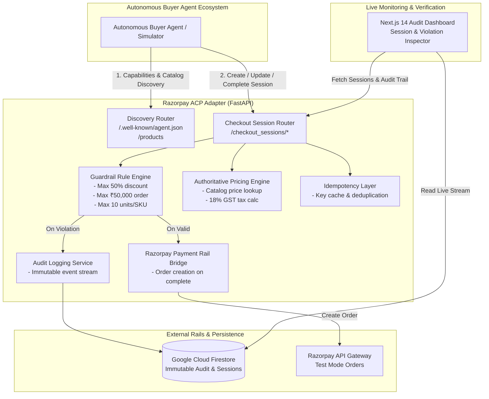
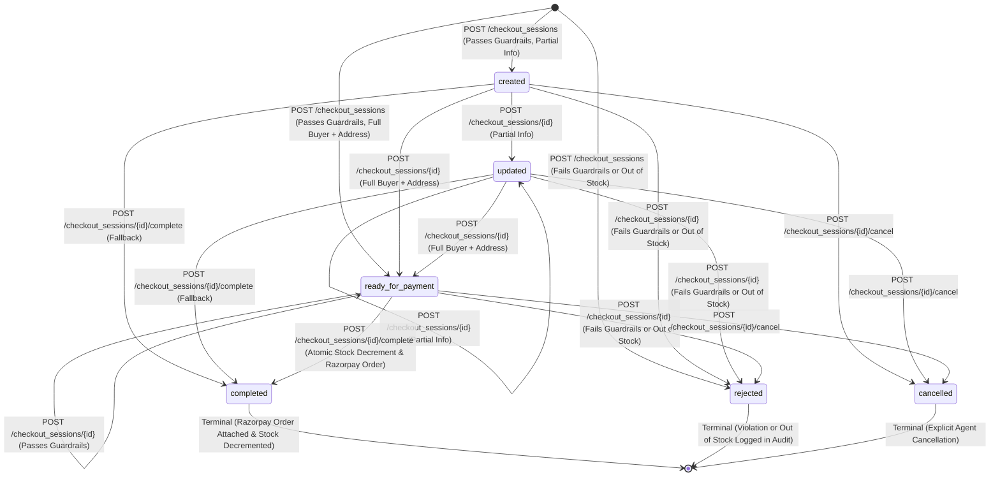

# Architecture & Protocol Design — Razorpay ACP Adapter

This document details the architectural layout, component interactions, and state transition machine of the **Razorpay ACP (Agentic Commerce Protocol) Checkout Adapter**.

---

## 1. High-Level System Architecture

---

## 2. Checkout Session State Machine

The checkout session implements a deterministic finite state machine (FSM):

---

## 3. Component Breakdown

### A. Discovery Layer (`backend/routers/discovery.py`)
- **`GET /.well-known/agent.json`**: Implements machine-readable ACP capability feed disclosing supported versions, operations (`checkout_sessions`, `products`), currency (`INR`), and payment providers (`razorpay`).
- **`GET /products`**: Authoritative server-side SKU catalog containing pricing, currency, descriptions, and stock status.

### B. Authoritative Pricing Engine (`backend/services/pricing.py`)
- **Server Price Invariance**: Completely ignores client-supplied `unit_price` fields in incoming payloads to prevent price manipulation attacks by rogue agents.
- **Deterministic Math**: Calculates Subtotal, applies validated discount, computes 18% GST standard tax, and computes final `total`.

### C. Guardrail Rule Engine (`backend/services/guardrails.py`)
- **Max Discount Constraint**: Reject if discount > 50% of subtotal.
- **Max Order Value Constraint**: Reject if total > ₹50,000 INR.
- **Max Quantity Constraint**: Reject if any line item quantity > 10 units.
- **State Preservation**: On violation, session is moved to `rejected` state with an explicit human-readable rejection reason logged to the audit log.

### D. Razorpay Payment Rail Bridge (`backend/services/razorpay_service.py`)
- On `POST /checkout_sessions/{id}/complete`, interacts with Razorpay Orders API (`client.order.create`).
- Converts amount to smallest currency subunit (paise: `amount * 100`).
- Attaches the resulting `order_id` (e.g. `order_RvXy123...`) to `session.payment_provider.razorpay_order_id` and dispatches an ACP outbound webhook stub.

### E. Immutable Audit Logging Layer (`backend/services/audit.py`)
- Records structured `AuditEntry` objects (`id`, `session_id`, `action`, `actor`, `reason`, `before_total`, `after_total`, `timestamp`).
- Persists synchronously to Google Cloud Firestore native collections.
