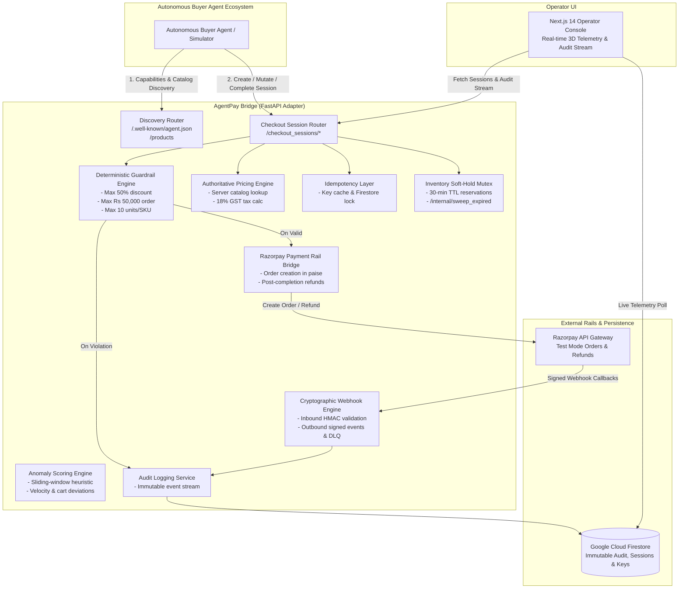
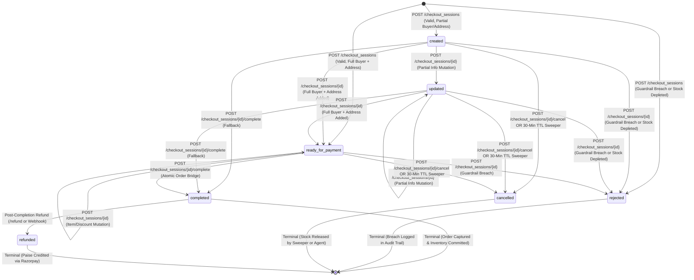

# Architecture & Protocol Design — AgentPay Bridge

> **ACP-compliant checkout adapter for autonomous AI buyer agents.**  
> *Payment rail: Razorpay Orders API.*

This document details the architectural layout, component interactions, and state transition machine of **AgentPay Bridge**.

---

## 1. High-Level System Architecture

---

## 2. Checkout Session Deterministic State Machine (FSM)

The checkout session implements a deterministic finite state machine (FSM) with atomic transitions:

---

## 3. Core Component Breakdown

### A. Discovery Layer (`backend/routers/discovery.py`)
- **`GET /.well-known/agent.json`**: Implements machine-readable ACP capability feed disclosing supported versions (`v2026-04-17`), operations (`checkout_sessions`, `products`), settlement currency (`INR`), rate limit guidelines, and payment provider (`razorpay`).
- **`GET /products`**: Authoritative server-side SKU catalog containing pricing, descriptions, currency, and stock levels.

### B. Authoritative Pricing Engine (`backend/services/pricing.py`)
- **Server Price Invariance**: Completely ignores client-supplied `unit_price` fields in incoming payloads to prevent price tampering attacks by rogue or hallucinating agents.
- **Deterministic Math**: Calculates Subtotal from server catalog, applies validated discount amounts, computes 18% GST standard tax, and derives final authoritative `total`.

### C. Deterministic Guardrail Engine (`backend/services/guardrails.py`)
- **Max Discount Constraint**: Reject if discount exceeds 50% of subtotal.
- **Max Order Value Constraint**: Reject if total exceeds Rs 50,000 INR.
- **Max Quantity Constraint**: Reject if any line item quantity exceeds 10 units.
- **Explainability**: On breach, transitions session to `rejected` state with an explicit human-readable violation reason logged immutably.

### D. Inventory Soft-Hold Mutex & TTL Sweeper (`backend/services/inventory.py` & `backend/services/sweeper.py`)
- **Atomic Reservations**: Line items reserve available stock upon session creation/update.
- **30-Minute Soft-Hold TTL**: Sessions hold stock for up to 30 minutes.
- **Automated Sweeper**: `POST /internal/sweep_expired` scans inactive sessions, releases held stock back to available inventory, and transitions expired sessions to `cancelled`.

### E. Razorpay Payment Rail Bridge (`backend/services/razorpay_service.py`)
- On `POST /checkout_sessions/{id}/complete`, interacts with Razorpay Orders API (`client.order.create`).
- Converts amount to smallest currency subunit (paise: `amount * 100`) with exponential retry backoff.
- Attaches the resulting `order_id` (e.g. `order_RvXy123...`) to `session.payment_provider.razorpay_order_id`.
- Supports post-completion refunds via `client.payment.refund`.

### F. Cryptographic Webhook Engine (`backend/routers/webhooks.py` & `backend/services/webhook_service.py`)
- **Inbound Verification**: Validates incoming Razorpay payment capture/refund webhooks using `hmac.compare_digest` against `X-Razorpay-Signature`.
- **Outbound Dispatch**: Dispatches signed events (`checkout.completed`, `checkout.rejected`, `checkout.refunded`) to registered agent endpoints with `X-ACP-Signature` (HMAC-SHA256) and `X-ACP-Timestamp`.
- **Dead-Letter Queue (DLQ)**: Retries failed delivery 3 times with exponential backoff before persisting to `/webhooks/agent/dead_letter`.

### G. Immutable Audit Logging Layer (`backend/services/audit.py`)
- Records structured `AuditEntry` objects (`id`, `session_id`, `action`, `actor`, `reason`, `before_total`, `after_total`, `timestamp`).
- Persists synchronously to Google Cloud Firestore native collections.
